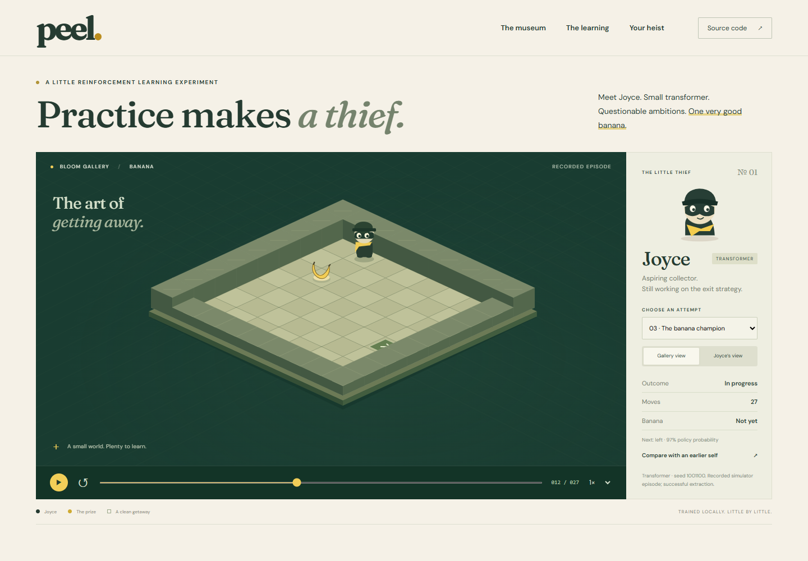
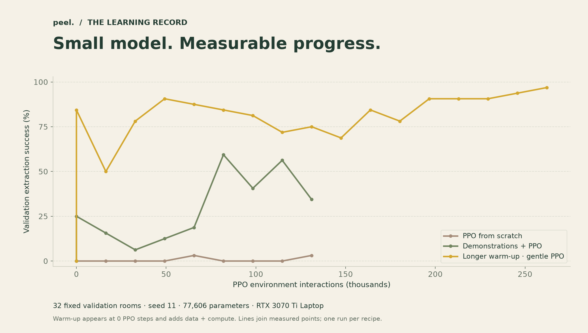

<div align="center">

# peel.
### Practice makes a thief.

A tiny transformer. A little museum. One very good banana.

[](https://github.com/RedLynx101/peel/actions/workflows/checks.yml)
[](LICENSE)

**Meet Joyce:** a 77,606-parameter policy learning to steal a banana and find the exit.

</div>



Peel is a local reinforcement-learning experiment with a deliberately small world and an unusually well-dressed thief. Watch recorded attempts, compare a checkpoint with its earlier self, switch to the policy's limited view, and paint a room for the trained model to attempt on your CPU.

The browser is a renderer. Python owns the rules. Training runs headlessly on a local GPU; the demo works without a GPU or an API key.

## Open the gallery

Requires **Python 3.12**, Git, and a browser. Clone this repository, then run:

```powershell
git clone https://github.com/RedLynx101/peel.git
cd peel
py -3.12 -m venv .venv
.venv\Scripts\python.exe -m pip install torch==2.11.0 --index-url https://download.pytorch.org/whl/cpu
.venv\Scripts\python.exe -m pip install -e ".[test]"
.venv\Scripts\python.exe -m peel.server
```

Open **http://127.0.0.1:8000**. No Node build is needed. On macOS/Linux use `python3.12` and `.venv/bin/python` in the equivalent commands; the CPU tests also run on Linux in CI. The recorded experiment was performed on Windows.

The repository includes a compact trained checkpoint and recorded episodes. **Try the heist** runs that policy on your edited map. It can fail, especially around doors and cameras. Scripted guide replays are labeled separately.

## What is learning?

Each action produces an occluded 5×5 symbolic observation, visible inventory, facing direction, previous action, remaining time, and camera direction only when the camera is visible. A causal transformer reads the latest 16 observations and emits five action probabilities and a value estimate.

1. An optional observable-history teacher supplies successful demonstrations for cross-entropy behavioral cloning.
2. PPO collects fresh episodes, including failures, and updates the policy using rewards and advantages.
3. Fixed validation rooms select the champion. `latest` continues training even if it is worse.
4. Atomic checkpoints retain optimizer state, RNG state, configuration, and counters. A bounded history keeps useful milestones.
5. A separate mastery curriculum can advance through exit → banana → locked door → rotating camera using training-domain probes. It stops when a stage exhausts its budget.

PPO is on-policy: successful trajectories are **not** blindly replayed as PPO batches. Success affects the gradient through returns and advantages; demonstrations are a separate, explicitly labeled phase. GELU is the transformer activation; Adam and backpropagation update its weights.

## Evidence, including the awkward parts



See the [experiment report](docs/EXPERIMENTS.md) for actual counts, untouched test results, uncertainty, configuration, failure cases, and timing. The checked-in JSONL records are the source of the charts. A warm-started policy and a PPO-only policy were trained at the same PPO interaction budget; demonstrations add extra data and computation, so this is not an equal-total-compute comparison.

The memory probe is a **separate supervised diagnostic** with identical final observations and different earlier cues. It checks that temporal information can be used; it does not prove that the heist policy needs or uses memory. One seed per main training recipe is an exploratory result, not a reliable algorithm ranking.

## Train locally

For the recorded NVIDIA CUDA setup, install the CUDA wheel into the virtual environment before installing the project:

```powershell
.venv\Scripts\python.exe -m pip install torch==2.11.0 --index-url https://download.pytorch.org/whl/cu128
.venv\Scripts\python.exe -c "import torch; print(torch.cuda.is_available())"
.venv\Scripts\python.exe -m peel.train --config configs/banana-study.json --run-dir runs/my-study
```

Use `--device cpu` for a CPU run. Each run needs a fresh directory. More recipes live in [configs/](configs/). The actual measured dependency versions are in [requirements-observed.txt](requirements-observed.txt).

```powershell
# Resume at fresh episode boundaries, extending a complete rollout budget.
.venv\Scripts\python.exe -m peel.train --config configs/banana-study.json --run-dir runs/my-study --resume runs/my-study/latest.pt --total-steps 262144

# Bounded automatic curriculum; advancement never reads the test namespace.
.venv\Scripts\python.exe -m peel.curriculum --config configs/tiny.json --run-dir runs/my-curriculum --blocks 2

# Evaluate only after selecting the checkpoint and freezing the experiment.
.venv\Scripts\python.exe -m peel.evaluate --checkpoint runs/my-study/champion.pt --stage banana --seed 2000000 --episodes 128 --output runs/my-study/test.json

# Controlled memory diagnostic, independent of heist training.
.venv\Scripts\python.exe -m peel.memory_benchmark --output runs/memory.json --device cpu
```

Checkpoint selection uses extraction count, then mean return, on a fixed validation suite. It is a practical small-sample selection rule, not a significance test. Keep final test rooms out of hyperparameter tuning. Resume restores RNG/optimizer state but begins fresh episodes, so it is **not bit-for-bit mid-episode continuation**. Curriculum stage transitions use weight-only warm starts; the CLI records its progress but does not yet resume an interrupted multi-stage curriculum automatically.

## Museum rules

| Item | Rule |
| --- | --- |
| Joyce | Turn left, turn right, move forward, interact, or wait |
| Banana | Interact from the neighboring tile; collect once |
| Key / door | Collect key, then interact with the locked door; key is consumed |
| Exit | Reach it with the banana; exit-only curriculum omits the banana |
| Camera | Checks its current cardinal ray, then rotates after each action |
| Clock | 96-action deadline, included in the observation |

Rewards: −0.01 per action; +0.1 key; +0.2 unlock; +1 banana; +10 escape; −5 capture. One-time events prevent collection loops from farming rewards. The map editor checks geometry, not timed camera solvability; generated camera maps receive a timed route check.

## Project guide

```text
src/peel/       simulator, teacher, transformer, PPO, checkpoints, API
web/            original Canvas art, replay UI, charts, map editor
configs/        saved training recipes
tests/          rules, privacy, causality, history, resume, API, curriculum
artifacts/      measured logs, curated replays, trained weights, charts, screenshots
docs/           experiments, model card, architecture, verification, routing
scripts/        reproducible exports and convenience commands
runs/           ignored local checkpoints and full training outputs
```

- [Experiment report](docs/EXPERIMENTS.md) · [Model card](docs/MODEL_CARD.md)
- [Backend and observation contract](docs/BACKEND.md) · [Design](docs/DESIGN.md)
- [Verification evidence](docs/QA.md) · [Model routing and actual use](docs/MODEL_ROUTING.md)
- [Third-party notices](docs/THIRD_PARTY.md) · [Contributing](CONTRIBUTING.md)

The first release intentionally keeps a fixed-size grid, short context, eager float32 training, a CPU inference API, and plain JavaScript. It does not include moving guards, arbitrary 3D physics, distributed training, a public inference service, or claims of general intelligence. Earlier-task replay mixing and statistically stronger checkpoint promotion are future work.

## Development

```powershell
.venv\Scripts\python.exe -m pytest
.venv\Scripts\python.exe -m ruff check src tests scripts
npm ci
npm run check
npm run format:check
```

Development tools: `pip install ruff==0.16.6 matplotlib==3.11.1`. The frontend has no runtime JavaScript dependencies; fonts are local, with their OFL licenses. Charts can be regenerated using `python scripts/build_report.py` after installing the project and Matplotlib.

Created by [Noah Hicks](https://noahhicks.com). Code and original artwork: [MIT](LICENSE). Bundled fonts retain their own licenses. The repository starts private for review; no public deployment is included.

*No bananas were harmed in the training of this model. Joyce will return.*
