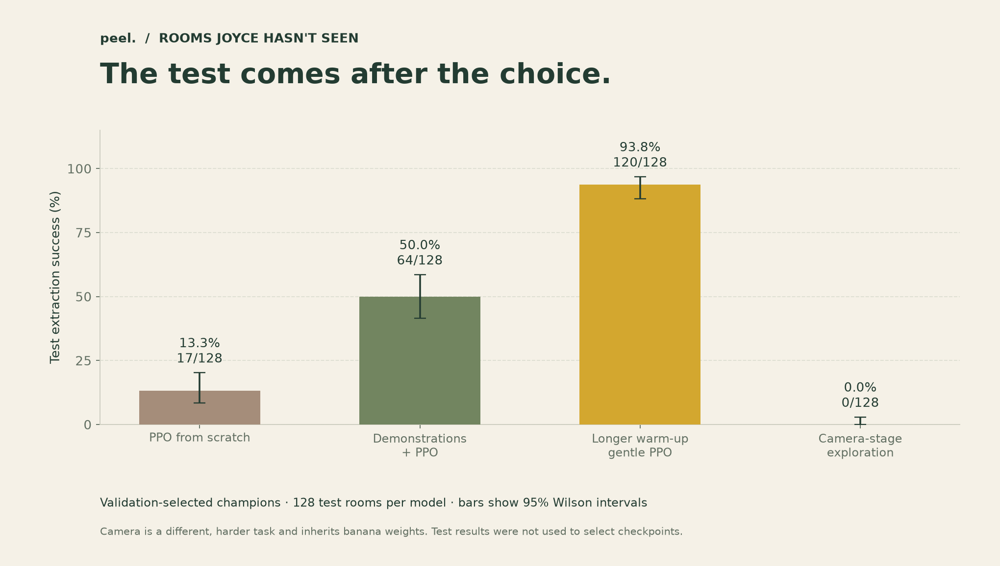
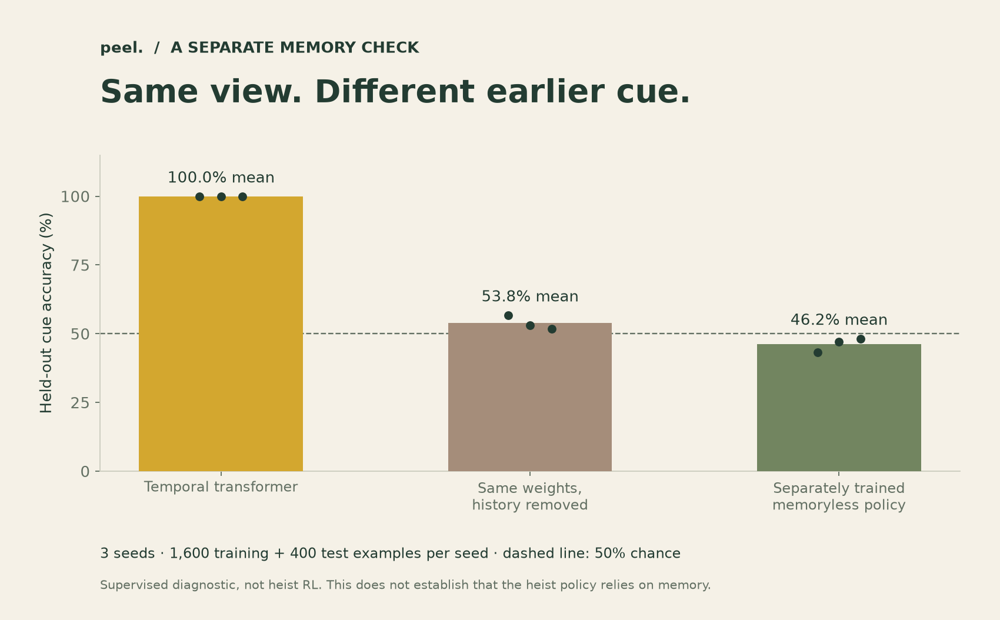

# Experiment record

Measured locally on September 5, 2026. These are exploratory results, not replicated algorithm benchmarks.

## Training recipes and selection

| Run | Stage | Demonstrations / epochs | PPO steps | Best validation | Selected step | PPO log duration |
| --- | --- | --- | --- | --- | --- | --- |
| PPO from scratch | banana | 0 / 0 | 131,072 | 1/32 (3.1%) | 131,072 | 196.4 s |
| Demonstrations + PPO | banana | 1,024 / 8 | 131,072 | 19/32 (59.4%) | 81,920 | 224.3 s |
| Longer warm-up · gentle PPO | banana | 2,048 / 20 | 262,144 | 31/32 (96.9%) | 262,144 | 333.9 s |
| Camera-stage exploration | camera | 2,048 / 16 | 131,072 | 10/32 (31.2%) | 0 | 276.8 s |

PPO duration is the last update's wall-clock field: it excludes demonstration collection/training, initial evaluation, and the final evaluation/export. It includes intermediate evaluations and checkpoint writes. It is not total time-to-solution. The camera run also has `runtime.json` with end-to-end elapsed time and peak CUDA allocation; that run shared CPU resources with final banana evaluation.

The first two banana recipes use 131,072 PPO interactions and the same seed/validation rooms. The refined recipe doubles that budget, doubles demonstrations to 2,048, uses 20 imitation epochs, and reduces the PPO learning rate from 3e-4 to 5e-5. Therefore the improvement cannot be attributed to just one of those changes. The camera run uses weights from the refined banana champion, 2,048 new camera demonstrations, 16 imitation epochs, and 131,072 PPO interactions. Its score is not directly comparable to the easier banana task.

## Untouched test rooms

Checkpoints were selected on validation before test evaluation. All test models use seeds 2,000,000–2,000,127. Re-evaluation exports reuse cached results only when checkpoint SHA256 matches. Every episode's seed, outcome, return, and length is retained in `artifacts/data/runs/*/test-*.json`.

| Run | Weights | Escapes / 128 | Success | 95% Wilson interval |
| --- | --- | --- | --- | --- |
| banana-scratch-seed11 | random | 0/128 | 0.0% | 0.0%–2.9% |
| banana-scratch-seed11 | champion | 17/128 | 13.3% | 8.5%–20.2% |
| banana-scratch-seed11 | latest | 17/128 | 13.3% | 8.5%–20.2% |
| banana-study-seed11 | random | 0/128 | 0.0% | 0.0%–2.9% |
| banana-study-seed11 | bc | 3/128 | 2.3% | 0.8%–6.7% |
| banana-study-seed11 | champion | 64/128 | 50.0% | 41.5%–58.5% |
| banana-study-seed11 | latest | 51/128 | 39.8% | 31.8%–48.5% |
| banana-refined-seed11 | random | 0/128 | 0.0% | 0.0%–2.9% |
| banana-refined-seed11 | bc | 15/128 | 11.7% | 7.2%–18.4% |
| banana-refined-seed11 | champion | 120/128 | 93.8% | 88.2%–96.8% |
| banana-refined-seed11 | latest | 120/128 | 93.8% | 88.2%–96.8% |
| camera-study-seed23 | bc | 0/128 | 0.0% | 0.0%–2.9% |
| camera-study-seed23 | champion | 0/128 | 0.0% | 0.0%–2.9% |
| camera-study-seed23 | latest | 0/128 | 0.0% | 0.0%–2.9% |

The intervals describe uncertainty across these sampled rooms for fixed models. They do not measure variation across training seeds or correct for repeated validation selection. Layouts can repeat within a split. Start rows are disjoint by construction: training uses 2/4/6, validation 1/3/5, test 7. This is a structured distribution shift, not an IID random split; a seed namespace alone would not have guaranteed different map contents.

## Memory diagnostic

A cue appears only in the first observation. All later observations, time, previous action, and inventory are identical across labels. The correct two-way choice depends on the cue. Each seed uses 2,000 synthetic examples, an 80/20 split, a one-layer transformer, and 10 supervised epochs.

| Seed | History | Same model, history removed | Separately trained memoryless |
| --- | --- | --- | --- |
| 123 | 100.00% | 56.75% | 43.25% |
| 124 | 100.00% | 53.00% | 47.00% |
| 125 | 100.00% | 51.75% | 48.25% |

History removal changes the input distribution and leaves no label information; a constant prediction can be above or below 50% because the sampled labels are not exactly balanced. The independently trained memoryless baseline is the stronger control. These results establish cue access in this diagnostic, not memory dependence of the heist policy.

## Failure modes and scope

- The initial BC/PPO run regressed after warm-up and after its best checkpoint. Latest and champion are deliberately separate.
- A short temporal window forgets observations older than 16 steps. The teacher can retain a map for the whole episode, which the student cannot exactly imitate in every state.
- Demonstration distribution shift can trap the policy after an early wrong turn. PPO from scratch is sample-inefficient at this budget.
- Camera maps add key/door dependencies and timing. Editor geometry checks cannot guarantee a safe timed route.
- Showcase episodes are successful validation examples chosen for visualization; they are not a random sample or evidence of aggregate competence.
- Only one main training seed per recipe was run. Stronger claims require repeated independent training seeds, larger validation suites, and a newly reserved test suite.
- The automatic curriculum is implemented and tested for advancement and budget exhaustion. The reported camera transfer was launched explicitly, not presented as a completed autonomous mastery curriculum.

## Reproduce the evidence

Use the saved configs and commands in README. The camera command adds `--warm-start runs/banana-refined-seed11/champion.pt`. Run `python scripts/publish_study.py` after all recipes are frozen, then `python scripts/build_report.py`. Training is stochastic; exact values may differ across PyTorch versions, devices, and scheduling. Raw logs, configs, hashes, model weights, and the observation version travel with the repository.
